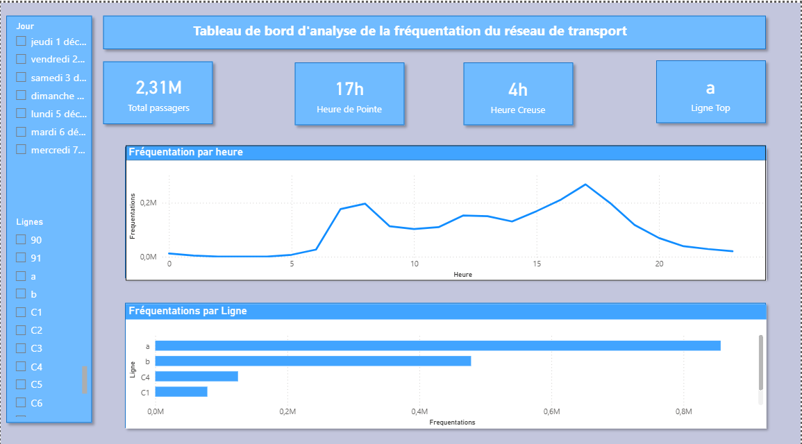

# 🚌 Analyse fréquentation réseau

Analyse de la fréquentation d'un réseau de transport public  afin d'identifier les heures de pointe, les heures creuses et les lignes stratégiques, pour aider à l'ajustement de l'offre de bus.

## Contexte et problématique


**Objectif métier :** Comprendre combien de personnes voyagent, sur quelles lignes et à quelles heures, afin d'aider l'entreprise à décider s'il faut renforcer ou réduire l'offre de bus sur un trajet spécifique pour réduire les coûts d'exploitation en heures creuses tout en évitant la saturation et les pénalités de retard en heures de pointe.

**Question centrale :** À quels moments et sur quelles lignes faut-il ajuster l'offre de transport pour répondre à la demande réelle des voyageurs ?

##  Source des données

Données de fréquentation détaillées du réseau STAR (Keolis Rennes), issues du portail Open Data [data.explore.star.fr](https://data.explore.star.fr) — extrait sur une semaine (décembre 2022), au pas de 15 minutes, par arrêt, ligne, sens et créneau horaire.

##  Pipeline de traitement des données

1. **Nettoyage (Excel / Power Query)**
   - Sélection des colonnes utiles (`DateFreq`, `TrancheHoraire15mn`, `NomArret`, `NomCourtLigne`, `Sens`, `Frequentation`)
   - Filtrage sur une semaine de données
   - Extraction de l'heure pleine à partir de la tranche horaire (15 min)
   - Export en CSV

2. **Structuration et nettoyage (SQL Server)**
   - Import initial en table "brute" (types texte, pour sécuriser l'import)
   - Création d'une table de conversion (*staging table*) avec les bons types (`DATE`, `TIME`, `TINYINT`, `FLOAT`)
   - Correction du format de date européen (`JJ/MM/AAAA` → `DATE` via `CONVERT(..., 103)`)
   - Conversion des décimales (virgule → point) pour la colonne `Frequentation`
   - Bascule vers la table propre définitive

3. **Analyse métier (SQL)**
   - Requêtes d'agrégation pour identifier heures de pointe, heures creuses, variations par jour et classement des lignes
   - Exclusion de la ligne technique `9999` (autocars de tourisme, hors périmètre du réseau régulier de transport urbain)

4. **Visualisation (Power BI)**
   - Connexion à SQL Server (table `frequentation_star`)
   - Création de mesures DAX (`Total Passagers`, `Heure de Pointe`, `Heure Creuse`, `Ligne Top`) recalculées dynamiquement selon le contexte de filtre
   - Ajout de deux segments interactifs :
     - Par **ligne** (`NomCourtLigne`) :isoler une ligne précise pour voir son propre profil de fréquentation
     - Par **jour** (`DateFreq`) : explorer la dynamique hebdomadaire directement dans le dashboard (comparer un jour à un autre)
   - Tableau de bord avec cartes KPI dynamiques, courbe de fréquentation horaire et classement des lignes, entièrement recalculés selon les segments sélectionnés

## 📈 Principaux résultats

| Indicateur | Résultat |
|---|---|
| Heure de pointe | 17h (~268 000 passagers), suivie de 16h et 18h. Pic secondaire le matin à 8h (~197 000 passagers) |
| Heure creuse | Creux absolu la nuit (2h-4h). Creux opérationnel de journée entre 10h et 14h |
| Dynamique hebdomadaire | Explorable directement via le segment "Jour" du dashboard : fréquentation stable en semaine, avec des variations visibles entre jours ouvrés et week-end |
| Hiérarchie des lignes | Domination des lignes de métro (a et b), suivies des lignes de bus majeures (Chronostar : C4, C1) |

## 💡 Recommandations métier

- **Renforcer l'offre** entre 16h et 18h (pic à 17h) et autour de 8h, pour limiter la saturation et les risques de pénalités liées au retard.
- **Optimiser les coûts** en ajustant la fréquence des bus entre 10h et 14h, période à faible demande.
- **Prioriser les investissements** sur les lignes de métro (a, b) et les lignes Chronostar (C4, C1), qui concentrent l'essentiel du trafic.

##  Stack technique

- **Power Query (Excel)** : nettoyage et préparation des données
- **SQL Server / T-SQL** : structuration, conversion de types, requêtes d'agrégation métier
- **Power BI / DAX** : tableau de bord interactif (KPI dynamiques, courbe temporelle, classement par ligne, segment)

##  Mesures DAX clés

Les 4 indicateurs du tableau de bord sont pilotés par des mesures DAX plutôt que par des colonnes statiques, afin de rester interactifs avec le segment par ligne :

```dax
Total Passagers = SUM(frequentation_star[Frequentation])

Heure de Pointe = 
VAR TableParHeure = 
    SUMMARIZE(
        frequentation_star,
        frequentation_star[Heure],
        "Total", SUM(frequentation_star[Frequentation])
    )
VAR HeureMax = TOPN(1, TableParHeure, [Total], DESC)
RETURN
    MAXX(HeureMax, frequentation_star[Heure]) & "h"

Heure Creuse = 
VAR TableParHeure = 
    SUMMARIZE(
        frequentation_star,
        frequentation_star[Heure],
        "Total", SUM(frequentation_star[Frequentation])
    )
VAR HeureMin = TOPN(1, TableParHeure, [Total], ASC)
RETURN
    MAXX(HeureMin, frequentation_star[Heure]) & "h"


Ligne Top = 
VAR TableParLigne = 
    SUMMARIZE(
        FILTER(frequentation_star, frequentation_star[NomCourtLigne] <> "9999"),
        frequentation_star[NomCourtLigne],
        "Total", SUM(frequentation_star[Frequentation])
    )
VAR LigneMax = TOPN(1, TableParLigne, [Total], DESC)
RETURN
    MAXX(LigneMax, frequentation_star[NomCourtLigne])
```

*(la mesure `Heure Creuse` suit la même logique que `Heure de Pointe`, avec un tri croissant)*

##  Aperçu du tableau de bord



Une démonstration vidéo de l'interactivité du dashboard (segments par ligne et par jour) est disponible dans `demo/dashboard_demo.mp4`.

##  Structure du repository

```
├── data/
│   └── donnees_propres_star.csv           # Données nettoyées (extrait 1 semaine)
├── sql/
│   └── analyse_frequentation_star.sql     # Script complet : nettoyage + requêtes
├── powerbi/
│   └── analyse_frequentation_reseau.pbix  # Fichier Power BI (dashboard interactif)
├── images/
│   └── dashboard_screenshot.png           # Capture du tableau de bord final
├── demo/
│   └── dashboard_demo.mp4                 # Démonstration vidéo de l'interactivité
└── README.md
```

## 👤 Auteur

Ben-enfane Assoumani — Étudiant en Master  Statistique et Sciences des Données, Université de Montpellier
[LinkedIn](https://www.linkedin.com/in/ben-enfaneassoumani)
